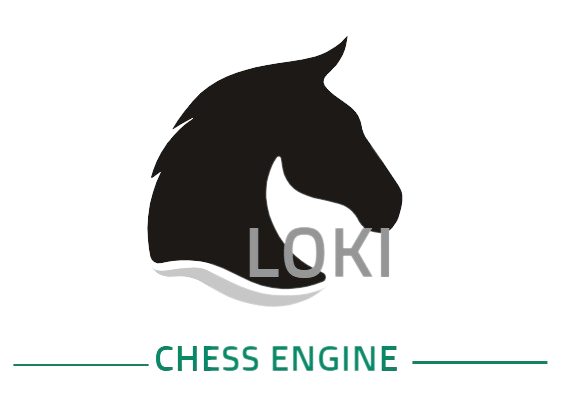

    

## Introduction
Loki is a UCI-compliant chess engine written in C++20. At this moment, Loki is undergoing an extensive refactoring, which is explained below.

## Implementation
The upcoming version, Loki 4.0, has been re-written to feature a faster, safer and more
modern design philosophy. The goal of the refactor is two-fold:
- Firstly, to improve the codebase's maintainability by making the implementation more object-oriented,
removing global variables, etc.. Additionally, the experience gathered during the development of 
previous versions of Loki provides an opportunity to design an architecture that solves earlier problems.
- Secondly, to remove bugs and thus making the chess engine stronger and faster.

#### Board representation
Loki uses bitboards at its main board representation, but also holds piece lists to make
piece and square lookup faster.

#### Move generation
- Magic Bitboards, as implemented by maksimKorzh, for generation of sliding piece attacks.
- Pseudo-legal move generator with legality check in the make move function.

The move generator achieves around 30 million nodes per second on a perft test to a depth of six plies
from the initial position (*approx. 25-30% faster than Loki 3.5.0*), without bulk-counting.

#### Evaluation
Due to the early stage of refactoring, the evaluation currently only consists of the following term(s):
- Material

Later on, the following terms (which Loki 3.5.0 has) will be tested and added if they prove to
offer a strength gain (in no particular order):
- Piece-square tables.
- Material imbalances.
- Pawn structure and passed pawns.
- Space term in the middlegame
- Safe piece mobility evaluation.
- King safety evaluation.
- Specialized piece evaluation. This has been implemented, but lost elo, so it is disabled at the moment. I will experiment with it in the future.
- Evaluation tapering between middlegame and endgame
- Evaluation hash table and pawn hash table.

Tuning will also be added, which will be much better than previous versions. 
This is because Loki will have the ability to load its evaluation parameters from an XML file
allowing more knowledge of each term by itself of the tuner.

#### Search
As with the evaluation, the early stage of refactoring means that the search is very limited at this point.
It consists of the following:
- Fail-hard principal variation search

Again, the following techniques provided strength gains for earlier Loki versions, so they will
be tested:
- Lazy SMP
- Transposition table.
- Iterative deepening.
- Aspiration windows.
- Fail-hard principal variation search.
    - Staged move generation.
    - Mate distance pruning.
    - Adaptive Null move pruning.
    - Enhanced futility pruning.
    - Reverse futility pruning.
    - Razoring.
    - In check extensions
    - Late move pruning.
    - Late move reductions.
- Quiescence search to resolve captures
    - SEE pruning of bad captures.

With all the above mentioned move ordering techniques, Loki 3.5.0 achieves a cutoff on the first move around 85%-90% of the time.

##### Move ordering
Loki 3.5.0's move ordering techniques consists of:
1. Transposition table move (*if applicable*)
2. Capture sorting:
    - Static Exchange Evaluation
    - Mvv/Lva
3. Sorting of quiet moves:
    - Killer moves
    - History heuristic

The move scoring is combined with a staged move generation to improve speed.

## Building Loki
**A build-guide for Loki will be written when the refactoring is done.**

## Elo history
| Version   | Elo   | TC   |
|-----------|-------|------|
| 1.0.2    | 1766  | 2'+1"|
| 1.2.0     | 1821  | 2'+1"|
| 2.0.0     | 2036  | 2'+1"|
| 3.0.0     | 2466  | 2'+1"|
| 3.5.0     | 2490  | 40/15|

## Special thanks to
- The [Chessprogramming Wiki](https://www.chessprogramming.org/Main_Page) which has been used extensively throughout the creation of Loki.
- [BlueFeverSoft](https://github.com/bluefeversoft), the creator of the Vice chess engine. Some of the code in Loki have been inspired from Vice. This is especially true for the UCI-implementation, which has nearly been copied.
- The Stockfish source code and community, which has been used where the wiki fell short.
- [spsa](https://github.com/zamar/spsa) the repository for tuning StockFish, which has been a big help in implementing Loki's SPSA tuner.
- [Evaluation & Tuning in Chess Engines](https://github.com/AndyGrant/Ethereal/blob/master/Tuning.pdf), a paper written by Andrew Grant (creator of Ethereal), on tuning chess engines, which has contributed to my understanding of the usage of gradient descent algorithms in chess engines.
- The creator of [Laser](https://github.com/jeffreyan11/laser-chess-engine) whose implementation of Lazy SMP has served as the inspiration for the one in Loki.
- The [Computer Chess Club](http://www.talkchess.com/forum3/viewforum.php?f=7) which has provided a lot of knowledge and tips.
- The creator of [chess_programming](https://github.com/maksimKorzh/chess_programming) from whom I've found Tord Romstad's implementation of magic bitboards.
- [Cute Chess](https://cutechess.com/) the tool used for testing changes and additions.
- Marcel Vanthoor, the author of the chess engine [Rustic](https://github.com/mvanthoor/rustic). Between Loki 2.0.0 and Loki 3.0.0, he contacted me saying that Loki was underperforming, its feature set taken into account. If he hadn't told me that, Loki would very likely still be at ~1900-2000 elo.
- Jay Honnold, the creator of the chess engine [Berserk](https://github.com/jhonnold/berserk), who generously let me set up an OpenBench client on his server, which is the tool used for testing changes in Loki currently.